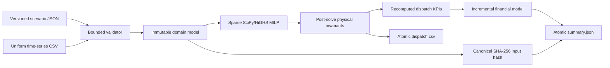

# Architecture

## Context

The product evaluates one bounded PV-BESS scenario locally. The first release deliberately keeps scientific code independent from web frameworks, databases, report templates, and vendor-specific engineering modules.

## Calculation flow

## Modules

| Module | Responsibility | Must not own |
| --- | --- | --- |
| `models.py` | immutable types, units, and domain validation | solver or file I/O |
| `provenance.py` | canonical scenario serialization and hashing | timestamps of result generation |
| `dispatch.py` | MILP construction, solve, invariant checks, and operating KPIs | financial assumptions or presentation |
| `finance.py` | cash flows and investment metrics | dispatch decisions |
| `io.py` | bounded input and failure-safe paired result publication | business formulas |
| `cli.py` | user-facing orchestration and exit behavior | duplicated calculations |

## Trust boundaries

1. JSON/CSV files are untrusted until bounded and validated.
2. Solver output is untrusted until all physical invariants are recomputed.
3. Financial calculations accept only a dispatch result whose input hash matches the supplied scenario.
4. Exported evidence distinguishes inputs, solver metadata, operating KPIs, cash flows, units, and limitations.

## Dependency policy

The domain package has two runtime dependencies: NumPy for numerical vectors and SciPy for sparse matrices and the HiGHS-backed MILP interface. No module opens a network connection. Direct runtime versions are pinned in `requirements.txt`; supported ranges are declared in `pyproject.toml`.

## Future boundaries

- A future API will call the same domain functions and expose versioned resources under `/api/v1`.
- PostgreSQL will persist scenario metadata and immutable result references, not solver internals.
- Long-running annual scenarios will use jobs only after benchmarks define the synchronous envelope.
- The Energy Asset Investment Lab may consume a versioned result bundle but will not import ORM models or share a database.
